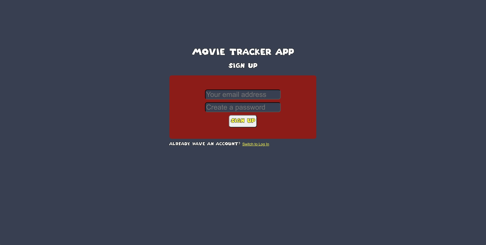

# Authentication

A web application demonstrating user authentication, API development and frontend implementation using ReactJS.

<p align="center">
  <br>
  
  <br>
</p>

<p align="center" >
    <a href="#features">Features</a> •
    <a href="#Files">Files</a> •
    <a href="#how-to-use">How To Use</a> • 
</p>

<p align="center" >
<a href="#">Try it out here</a> 
</p>

## Features

* React
```bash
# Install dependencies
$ npm i
# run the app
$ npm run dev:client
```

## Files
- api: contains files related to the backend API development.
- client: contains files for the frontend React.js app 

## How To Use

To clone and run this application, you'll need [Git](https://git-scm.com), [Node.js](https://nodejs.org/en) installed on your computer. From your command line:

```bash
# Clone this repository
$ git clone #

# Install dependencies
$ npm i

# Run the app
$ npm run dev:client
```